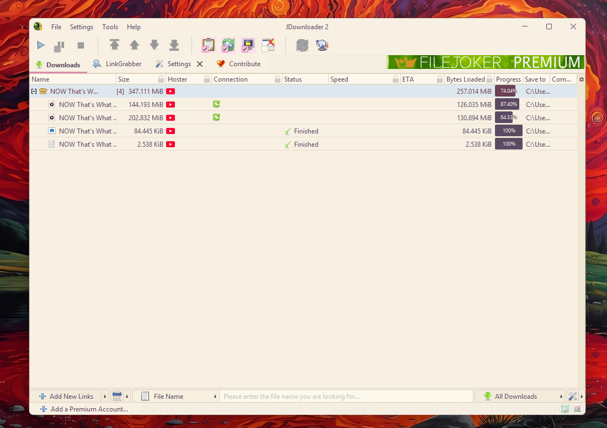
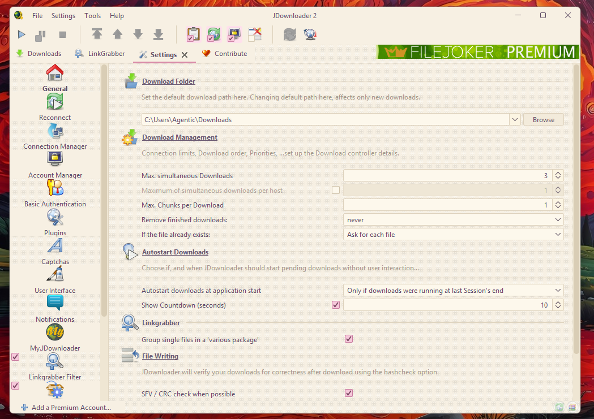

# Pastel98

Tema claro **FlatLaf** para JDownloader 2 con estética *PC-98*: superficies crema
pastel, acento rosa empolvado, texto ciruela — y una grana tonal sutil (dither)
en los fondos, como en los juegos de la época.





## Características

- Paleta crema/rosa inspirada en las paletas de 16 colores del NEC PC-98
- **Dither tonal real** en paneles y desktop: los fondos no son planos, llevan un
  patrón Bayer 4×4 con vecinos apenas más oscuros y destellos hacia blanco cálido
  (nunca píxeles negros), implementado con UI delegates propios que extienden FlatLaf
- Texto legible dentro de las barras de progreso (oscuro sobre pista crema,
  blanco cálido sobre relleno rosa)
- Colores JD2 afinados: filas de paquete, tooltips, hover, speed meter y bordes
- Sin iconos custom (usa el set estándar)

## Compatibilidad

**No requiere parche en `JDownloader.jar`.**

Contexto: JDownloader tiene un hardcode en `ExtProgressColumn` que elige el color
del texto de las barras por luminosidad del fondo — blanco sobre fondos oscuros,
negro sobre claros. Los temas oscuros (como [Phosphor](https://github.com/deviceargent/Phosphor))
necesitan parchar el jar para evitar texto blanco ilegible. Pastel98, al ser claro,
recibe **negro**: legible de fábrica, sin tocar nada.

Si además aplicás el parche (o ya lo tenés), el texto de la columna de progreso
usa el ciruela del tema en vez de negro puro — apenas más prolijo, pero opcional.

## Instalación

1. Descargá [`FlatPastel98.jar`](https://github.com/deviceargent/jdownloader-themes/raw/Pastel98/FlatPastel98.jar)
   y copialo a `<carpeta de JDownloader 2>\libs\laf\`
2. Descargá [`cfg/Pastel98.json`](https://github.com/deviceargent/jdownloader-themes/raw/Pastel98/cfg/Pastel98.json)
   y copialo a `cfg\laf\`
3. Con JDownloader cerrado, en `cfg\settings\org.jdownloader.settings.GraphicalUserInterfaceSettings.json`
   (si el archivo está en otra ruta, buscá `GraphicalUserInterfaceSettings.json` dentro de `cfg`)
   seteá:
   ```json
   "customlookandfeelclass": "com.github.deviceargent.pastel98.Pastel98"
   ```
4. Iniciá JDownloader

> Requiere el `flatlaf.jar` que ya trae JDownloader 2 (probado con 3.7.x). No hace falta nada más.

## Paleta

| Uso | Color |
|-----|-------|
| Fondo base | `#f7f0e3` |
| Superficie clara / highlight | `#fffaef` |
| Botones | `#f3ebdb` |
| Texto principal | `#5c4a63` |
| Selección | `#ffd9e6` + texto `#6b4055` |
| Acento (focus, links, progreso) | `#d98aa8` / `#e88ab0` |
| Bordes | `#ddd1bc` |

## Hover de Settings (opcional)

El hover del mouse sobre los iconos de la sidebar de Ajustes lo pinta el código de
JD2 (`ConfigSidebar`) con un tono genérico. Para que use el dusty del tema hace falta
un parche en `libs\JDGUI.jar` (no en `JDownloader.jar`; no afecta la legibilidad):

```powershell
Set-ExecutionPolicy -Scope Process Bypass
.\patch\Install-Pastel98-Hover.ps1
```

El color se lee de `ConfigSidebar.hoverBackground` (definida en el tema, `#c4a0a0`).
El script hace backup automático y es idempotente.

## Compilar desde fuente

```bash
javac -cp flatlaf.jar -d bin src/com/github/deviceargent/pastel98/*.java
cp src/com/github/deviceargent/pastel98/*.properties bin/com/github/deviceargent/pastel98/
jar cf FlatPastel98.jar -C bin .
```

El CI de esta rama reconstruye el jar automáticamente en cada push a `src/`.
